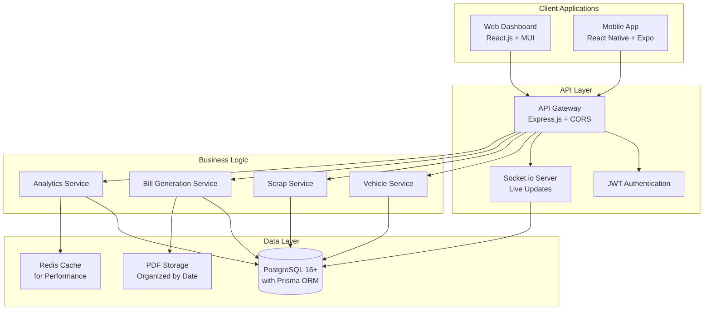

# Design Document: Vighneshwara Enterprises Income Dashboard

## Overview

The Vighneshwara Enterprises Income Dashboard is a comprehensive web-based business management system designed specifically for a scrap trading business with vehicle operations. The system combines vehicle income/expense tracking, scrap purchase/sale management, and professional bill generation into a unified dashboard that maintains consistency with existing business processes.

The application will serve as the digital transformation of their current paper-based system while preserving their established bill formats, company branding, and business workflows.

## Architecture

### Modern Multi-Platform Architecture



### Modern UI/UX Design Philosophy

#### Web Dashboard Design
- **Material Design 3**: Latest Material-UI components with custom Vighneshwara theme
- **Glass Morphism**: Modern frosted glass effects for cards and modals
- **Micro-interactions**: Smooth hover effects, loading animations, and transitions
- **Dark/Light Mode**: Automatic theme switching with user preference
- **Responsive Grid**: CSS Grid and Flexbox for perfect layouts on all screen sizes
- **Color Palette**: 
  - Primary: Company red (#E53E3E)
  - Secondary: Company blue (#3182CE) 
  - Accent: Company green (#38A169)
  - Neutral: Modern grays with proper contrast ratios

#### Mobile App Design
- **Native Feel**: Platform-specific navigation (iOS/Android)
- **Gesture Support**: Swipe actions, pull-to-refresh, haptic feedback
- **Offline Capability**: Local storage with sync when online
- **Push Notifications**: Real-time alerts for important business events
- **Biometric Auth**: Fingerprint/Face ID for secure access
- **Adaptive Icons**: Dynamic app icons that match system themes

### Technology Stack

- **Frontend Framework**: React.js 18+ with JavaScript (ES2024)
- **Mobile App**: React Native with Expo for cross-platform APK generation
- **UI Framework**: 
  - **Web**: Material-UI (MUI) v5+ with custom theming
  - **Mobile**: React Native Elements + React Native Paper
- **State Management**: Redux Toolkit with RTK Query for API calls
- **Backend**: Node.js 20+ with Express.js and modern ES modules
- **Database**: PostgreSQL 16+ with Prisma ORM for modern database management
- **Real-time Updates**: Socket.io for live dashboard updates
- **Charts & Analytics**: Chart.js 4+ with react-chartjs-2 for stunning visualizations
- **PDF Generation**: Puppeteer for exact bill format replication
- **Styling**: 
  - **Web**: Styled-components with CSS-in-JS and Framer Motion for animations
  - **Mobile**: StyleSheet with React Native Reanimated 3 for smooth animations
- **Icons**: React Icons (web) + React Native Vector Icons (mobile)
- **Date Handling**: Day.js (lightweight alternative to Moment.js)
- **Form Handling**: React Hook Form with Yup validation

## Components and Interfaces

### Core Components

#### 1. Modern Dashboard Component
- **Purpose**: Stunning overview screen with real-time business metrics
- **Features**: 
  - Animated counter cards showing daily profits
  - Interactive charts with drill-down capabilities
  - Real-time updates via WebSocket connections
  - Quick action floating buttons with ripple effects
  - Weather widget integration for field operations
- **UI/UX**: 
  - **Web**: Material-UI cards with elevation and shadows
  - **Mobile**: Native card components with smooth animations
  - Live data visualization with Chart.js
  - Skeleton loading states for better perceived performance

#### 2. Smart Vehicle Management Component
- **Purpose**: Intuitive vehicle tracking with visual appeal
- **Features**:
  - Vehicle status indicators (active/idle/maintenance)
  - Drag-and-drop expense categorization
  - Photo upload for maintenance records
  - GPS integration for route tracking
  - Voice input for quick data entry
- **UI/UX**:
  - **Web**: Tabbed interface with smooth transitions
  - **Mobile**: Swipeable cards with gesture controls
  - Color-coded profit/loss indicators
  - Interactive timeline for vehicle history

#### 3. Advanced Scrap Transaction Component
- **Purpose**: Streamlined scrap trading with smart features
- **Features**:
  - Barcode scanning for quick item entry
  - Auto-complete for supplier/buyer names
  - Smart rate suggestions based on history
  - Bulk transaction import via CSV
  - Photo documentation for quality records
- **UI/UX**:
  - **Web**: Multi-step forms with progress indicators
  - **Mobile**: Camera integration for barcode scanning
  - Smart form validation with inline feedback
  - Predictive text for faster data entry

#### 4. Professional Bill Generation Component
- **Purpose**: Create stunning, print-ready bills instantly
- **Features**:
  - Live preview with zoom and pan
  - Multiple export formats (PDF, PNG, Email)
  - Digital signature integration
  - Batch bill generation
  - WhatsApp sharing integration
- **UI/UX**:
  - **Web**: Split-screen preview with real-time updates
  - **Mobile**: Full-screen preview with pinch-to-zoom
  - Professional templates with company branding
  - One-tap sharing to multiple platforms

#### 5. Interactive Analytics Component
- **Purpose**: Beautiful data visualization and insights
- **Features**:
  - Interactive charts with animations
  - Predictive analytics using trend analysis
  - Customizable dashboard widgets
  - Export reports in multiple formats
  - AI-powered business insights
- **UI/UX**:
  - **Web**: Responsive chart library with hover effects
  - **Mobile**: Touch-friendly charts with gesture zoom
  - Color-coded performance indicators
  - Smooth transitions between time periods

### API Interfaces

#### Modern REST API with Real-time Updates
```javascript
// Vehicle Operations API
const VehicleTransaction = {
  id: String,
  vehicleType: 'lorry' | 'truck-auto',
  transactionType: 'income' | 'expense',
  incomeType: 'rental' | 'transportation' | null,
  expenseType: 'petrol' | 'maintenance' | 'repairs' | 'other' | null,
  amount: Number,
  date: Date,
  description: String,
  vehicleNumber: String,
  photoUrl: String, // For maintenance records
  gpsLocation: Object, // For route tracking
  createdAt: Date,
  updatedAt: Date
};

// Scrap Operations API
const ScrapTransaction = {
  id: String,
  transactionType: 'purchase' | 'sale',
  partyName: String,
  partyAddress: String,
  partyPhone: String,
  partyGstin: String,
  scrapType: ScrapType,
  quantity: Number,
  rate: Number,
  totalAmount: Number,
  hsnCode: String,
  date: Date,
  vehicleNumber: String,
  photoUrl: String, // For quality documentation
  barcodeData: String, // For scanned items
  createdAt: Date,
  updatedAt: Date
};

// Enhanced Bill Generation API
const PurchaseVoucher = {
  voucherNumber: String,
  date: Date,
  supplierName: String,
  supplierDetails: Object,
  items: Array,
  vehicleNumber: String,
  totalAmount: Number,
  pdfUrl: String,
  digitalSignature: String,
  status: 'draft' | 'sent' | 'paid',
  createdAt: Date
};

const TaxInvoice = {
  invoiceNumber: String,
  invoiceDate: Date,
  reverseCharge: Boolean,
  transportationMode: String,
  vehicleNumber: String,
  dateOfSupply: Date,
  placeOfSupply: String,
  billedTo: Object,
  shippedTo: Object,
  items: Array,
  taxCalculations: Object,
  totalBeforeTax: Number,
  sgst: Number,
  cgst: Number,
  igst: Number,
  totalAfterTax: Number,
  pdfUrl: String,
  digitalSignature: String,
  status: 'draft' | 'sent' | 'paid',
  createdAt: Date
};

// Real-time WebSocket Events
const SocketEvents = {
  'transaction:created': (data) => {}, // New transaction added
  'profit:updated': (data) => {},      // Profit calculations updated
  'bill:generated': (data) => {},      // New bill created
  'dashboard:refresh': (data) => {}    // Dashboard data changed
};
```

## Data Models

### Modern Database Schema with Prisma ORM

#### Prisma Schema Definition
```javascript
// schema.prisma
generator client {
  provider = "prisma-client-js"
}

datasource db {
  provider = "postgresql"
  url      = env("DATABASE_URL")
}

model Vehicle {
  id            String   @id @default(cuid())
  vehicleType   VehicleType
  vehicleNumber String?
  status        VehicleStatus @default(ACTIVE)
  createdAt     DateTime @default(now())
  updatedAt     DateTime @updatedAt
  
  transactions  VehicleTransaction[]
  
  @@map("vehicles")
}

model VehicleTransaction {
  id              String   @id @default(cuid())
  vehicleId       String
  transactionType TransactionType
  incomeType      IncomeType?
  expenseType     ExpenseType?
  amount          Decimal  @db.Decimal(10,2)
  description     String?
  transactionDate DateTime
  vehicleNumber   String?
  photoUrl        String?
  gpsLocation     Json?
  createdAt       DateTime @default(now())
  updatedAt       DateTime @updatedAt
  
  vehicle         Vehicle  @relation(fields: [vehicleId], references: [id])
  
  @@map("vehicle_transactions")
}

model ScrapTransaction {
  id              String   @id @default(cuid())
  transactionType ScrapTransactionType
  partyName       String
  partyAddress    String?
  partyPhone      String?
  partyGstin      String?
  partyState      String?
  partyStateCode  String?
  scrapType       ScrapType
  quantity        Decimal  @db.Decimal(10,3)
  rate            Decimal  @db.Decimal(10,2)
  totalAmount     Decimal  @db.Decimal(10,2)
  hsnCode         String?
  transactionDate DateTime
  vehicleNumber   String?
  photoUrl        String?
  barcodeData     String?
  createdAt       DateTime @default(now())
  updatedAt       DateTime @updatedAt
  
  bills           Bill[]
  
  @@map("scrap_transactions")
}

model Bill {
  id                String   @id @default(cuid())
  billType          BillType
  billNumber        String   @unique
  billDate          DateTime
  partyName         String
  totalAmount       Decimal  @db.Decimal(10,2)
  pdfUrl            String?
  digitalSignature  String?
  status            BillStatus @default(DRAFT)
  transactionId     String?
  createdAt         DateTime @default(now())
  updatedAt         DateTime @updatedAt
  
  transaction       ScrapTransaction? @relation(fields: [transactionId], references: [id])
  
  @@map("bills")
}

// Enums
enum VehicleType {
  LORRY
  TRUCK_AUTO
}

enum VehicleStatus {
  ACTIVE
  MAINTENANCE
  IDLE
}

enum TransactionType {
  INCOME
  EXPENSE
}

enum IncomeType {
  RENTAL
  TRANSPORTATION
}

enum ExpenseType {
  PETROL
  MAINTENANCE
  REPAIRS
  OTHER
}

enum ScrapTransactionType {
  PURCHASE
  SALE
}

enum ScrapType {
  KB_WASTE
  OTB
  NB
  WRD
  HHT_ONP
  GTB
  BB
  ROAD_WASTE_PLASTIC
  DUPLEX_WASTE
  PLASTIC
  BLOCK_MATERIAL
  WASTE_PLASTIC
}

enum BillType {
  PURCHASE_VOUCHER
  TAX_INVOICE
}

enum BillStatus {
  DRAFT
  SENT
  PAID
}
```

### Business Logic Models with Modern JavaScript

#### Enhanced Daily Summary Model
```javascript
class DailySummary {
  constructor(date) {
    this.date = date;
    this.vehicleProfit = {
      lorry: { income: 0, expenses: 0, profit: 0 },
      truckAuto: { income: 0, expenses: 0, profit: 0 },
      total: 0
    };
    this.scrapProfit = {
      purchases: 0,
      sales: 0,
      profit: 0
    };
    this.totalBusinessProfit = 0;
    this.trends = {
      vehicleProfitTrend: 0, // % change from previous day
      scrapProfitTrend: 0,
      totalTrend: 0
    };
  }

  calculateTrends(previousDay) {
    if (previousDay) {
      this.trends.vehicleProfitTrend = 
        ((this.vehicleProfit.total - previousDay.vehicleProfit.total) / 
         previousDay.vehicleProfit.total) * 100;
      
      this.trends.scrapProfitTrend = 
        ((this.scrapProfit.profit - previousDay.scrapProfit.profit) / 
         previousDay.scrapProfit.profit) * 100;
      
      this.trends.totalTrend = 
        ((this.totalBusinessProfit - previousDay.totalBusinessProfit) / 
         previousDay.totalBusinessProfit) * 100;
    }
  }

  getPerformanceIndicators() {
    return {
      isVehicleProfitable: this.vehicleProfit.total > 0,
      isScrapProfitable: this.scrapProfit.profit > 0,
      bestPerformingVehicle: this.vehicleProfit.lorry.profit > 
                            this.vehicleProfit.truckAuto.profit ? 'lorry' : 'truckAuto',
      profitabilityRatio: this.scrapProfit.profit / this.vehicleProfit.total,
      riskLevel: this.calculateRiskLevel()
    };
  }

  calculateRiskLevel() {
    const totalExpenses = this.vehicleProfit.lorry.expenses + 
                         this.vehicleProfit.truckAuto.expenses + 
                         this.scrapProfit.purchases;
    const totalIncome = this.vehicleProfit.lorry.income + 
                       this.vehicleProfit.truckAuto.income + 
                       this.scrapProfit.sales;
    
    const expenseRatio = totalExpenses / totalIncome;
    
    if (expenseRatio > 0.8) return 'HIGH';
    if (expenseRatio > 0.6) return 'MEDIUM';
    return 'LOW';
  }
}
```

## Error Handling

### Validation Rules
- **Amount Validation**: All monetary amounts must be positive numbers
- **Date Validation**: Dates cannot be in the future
- **Scrap Type Validation**: Must match predefined list from existing voucher
- **Vehicle Type Validation**: Must be either 'lorry' or 'truck-auto'
- **GST Validation**: GSTIN format validation for tax invoices
- **Bill Number Validation**: Unique bill numbers with proper sequencing

### Error Response Format
```typescript
interface ErrorResponse {
  success: false;
  error: {
    code: string;
    message: string;
    field?: string;
  };
}
```

### Common Error Scenarios
- **Duplicate Bill Numbers**: Prevent duplicate bill generation
- **Invalid Scrap Types**: Reject entries not in predefined list
- **Calculation Errors**: Validate quantity × rate = total amount
- **Missing Required Fields**: Enforce required fields for bill generation
- **Database Connection Issues**: Graceful handling with retry logic

## Testing Strategy

### Unit Testing
- **Component Testing**: Test individual React components
- **API Testing**: Test all REST endpoints
- **Validation Testing**: Test all business rule validations
- **Calculation Testing**: Test profit calculations and bill totals
- **Database Testing**: Test all CRUD operations

### Property-Based Testing
Property-based tests will validate universal properties across all inputs using a JavaScript testing library like fast-check.

Each property test will run a minimum of 100 iterations and be tagged with the format:
**Feature: income-dashboard, Property {number}: {property_text}**

## Correctness Properties

*A property is a characteristic or behavior that should hold true across all valid executions of a system—essentially, a formal statement about what the system should do. Properties serve as the bridge between human-readable specifications and machine-verifiable correctness guarantees.*

### Property 1: Automatic Calculation Updates
*For any* business transaction (vehicle income/expense or scrap purchase/sale), when the transaction is recorded, all related totals and profit calculations should be updated immediately and correctly reflect the new data.
**Validates: Requirements 1.5, 2.4, 3.2, 8.5, 9.4, 10.3, 11.3**

### Property 2: Transaction Amount Calculation
*For any* scrap transaction (purchase or sale), the total amount should always equal quantity multiplied by rate, regardless of the specific values entered.
**Validates: Requirements 8.3, 9.2**

### Property 3: Profit Calculation Accuracy
*For any* time period and business area (vehicle operations or scrap trading), the calculated profit should always equal total income minus total expenses for that period and area.
**Validates: Requirements 3.1, 10.1, 11.1**

### Property 4: Input Validation Enforcement
*For any* data entry form, invalid inputs (negative amounts, future dates, invalid vehicle types, invalid expense categories) should be rejected and valid inputs should be accepted consistently.
**Validates: Requirements 5.1, 5.2, 5.4, 5.5**

### Property 5: Scrap Type Consistency
*For any* scrap transaction, the system should support exactly the same predefined scrap types for both purchases and sales, ensuring consistency across all operations.
**Validates: Requirements 8.2, 9.3**

### Property 6: Vehicle Data Separation
*For any* vehicle transaction, the data should be correctly associated with the specific vehicle (lorry or truck/auto) and calculations should remain separate between vehicles.
**Validates: Requirements 3.3, 6.3**

### Property 7: Historical Data Aggregation
*For any* date range and filter criteria, historical data queries should return accurate aggregated results that match the sum of individual transactions within that range.
**Validates: Requirements 7.1, 7.2, 7.3, 7.4**

### Property 8: Bill Data Integrity
*For any* generated bill (purchase voucher or tax invoice), all transaction data should be accurately transferred to the bill format with correct calculations and no data loss.
**Validates: Requirements 12.3, 13.3, 13.4, 13.5**

### Property 9: Bill History Management
*For any* generated bill, it should be stored in the system history and remain accessible for reprinting with all original data intact.
**Validates: Requirements 14.1, 14.2, 14.3, 14.4**

### Property 10: Duplicate Prevention
*For any* rental income entry, attempting to record the same rental income for the same vehicle on the same date should be prevented while allowing legitimate multiple entries.
**Validates: Requirements 5.3**

### Property 11: Required Field Validation
*For any* transaction entry (vehicle or scrap), all required fields must be present and valid before the transaction can be saved to the system.
**Validates: Requirements 1.3, 2.2, 8.1, 9.1**

### Property 12: Multi-Transaction Support
*For any* day, the system should support recording multiple transactions of the same type (multiple sales, multiple expenses) and correctly aggregate them in daily totals.
**Validates: Requirements 9.5**

### Integration Tests

#### End-to-End Workflow Testing
- **Complete Business Day Simulation**: Test recording vehicle transactions, scrap transactions, and bill generation in a typical business day workflow
- **Bill Generation Integration**: Test that transaction data flows correctly into bill generation with proper formatting
- **Dashboard Integration**: Test that all data entry updates the dashboard displays correctly

#### Cross-Component Testing
- **Vehicle-Scrap Integration**: Test scenarios where vehicle expenses relate to scrap collection activities
- **Bill-Transaction Integration**: Test that bills accurately reflect the underlying transaction data
- **Analytics Integration**: Test that analytics calculations use data from all system components correctly

### Mobile App Deployment Strategy

#### APK Generation and Distribution
```javascript
// expo.json configuration for APK generation
{
  "expo": {
    "name": "Vighneshwara Enterprises",
    "slug": "vighneshwara-dashboard",
    "version": "1.0.0",
    "orientation": "portrait",
    "icon": "./assets/ves-logo.png",
    "userInterfaceStyle": "automatic",
    "splash": {
      "image": "./assets/splash.png",
      "resizeMode": "contain",
      "backgroundColor": "#E53E3E"
    },
    "assetBundlePatterns": ["**/*"],
    "ios": {
      "supportsTablet": true,
      "bundleIdentifier": "com.vighneshwara.dashboard"
    },
    "android": {
      "adaptiveIcon": {
        "foregroundImage": "./assets/adaptive-icon.png",
        "backgroundColor": "#E53E3E"
      },
      "package": "com.vighneshwara.dashboard",
      "permissions": [
        "CAMERA",
        "READ_EXTERNAL_STORAGE",
        "WRITE_EXTERNAL_STORAGE",
        "ACCESS_FINE_LOCATION"
      ]
    },
    "web": {
      "favicon": "./assets/favicon.png"
    },
    "extra": {
      "eas": {
        "projectId": "vighneshwara-dashboard-id"
      }
    }
  }
}

// Build commands for APK generation
// Development build: npx expo build:android --type apk
// Production build: eas build --platform android --profile production
```

#### Progressive Web App (PWA) Features
```javascript
// Web app manifest for PWA capabilities
{
  "name": "Vighneshwara Enterprises Dashboard",
  "short_name": "VE Dashboard",
  "description": "Complete business management for Vighneshwara Enterprises",
  "start_url": "/",
  "display": "standalone",
  "background_color": "#E53E3E",
  "theme_color": "#E53E3E",
  "icons": [
    {
      "src": "/icons/icon-192x192.png",
      "sizes": "192x192",
      "type": "image/png"
    },
    {
      "src": "/icons/icon-512x512.png",
      "sizes": "512x512",
      "type": "image/png"
    }
  ],
  "categories": ["business", "finance", "productivity"],
  "screenshots": [
    {
      "src": "/screenshots/dashboard.png",
      "sizes": "1280x720",
      "type": "image/png"
    }
  ]
}
```

### Performance Optimization

#### Web Performance
- **Code Splitting**: Lazy loading of components with React.lazy()
- **Bundle Optimization**: Webpack bundle analyzer for size optimization
- **Caching Strategy**: Service worker for offline functionality
- **Image Optimization**: WebP format with fallbacks
- **CDN Integration**: Static assets served from CDN

#### Mobile Performance
- **Native Modules**: Expo modules for camera and file system access
- **Memory Management**: Proper cleanup of listeners and timers
- **Battery Optimization**: Background task limitations
- **Network Optimization**: Request batching and caching
- **Smooth Animations**: 60fps animations with React Native Reanimated

### Security Implementation

#### Authentication & Authorization
```javascript
// JWT-based authentication with refresh tokens
const authConfig = {
  accessTokenExpiry: '15m',
  refreshTokenExpiry: '7d',
  biometricAuth: true, // Mobile only
  sessionTimeout: '30m',
  maxLoginAttempts: 5,
  lockoutDuration: '15m'
};

// Role-based access control
const userRoles = {
  OWNER: ['all_permissions'],
  MANAGER: ['view_reports', 'create_transactions', 'generate_bills'],
  OPERATOR: ['create_transactions', 'view_dashboard']
};
```

#### Data Security
- **Encryption**: AES-256 encryption for sensitive data
- **HTTPS Only**: SSL/TLS for all communications
- **Input Sanitization**: XSS and SQL injection prevention
- **File Security**: Secure file upload with virus scanning
- **Audit Logging**: Complete audit trail for all actions

This design provides a comprehensive foundation for implementing the Vighneshwara Enterprises Income Dashboard while maintaining consistency with their existing business processes and ensuring data accuracy through property-based testing.